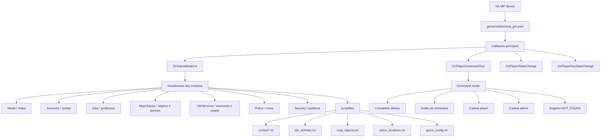
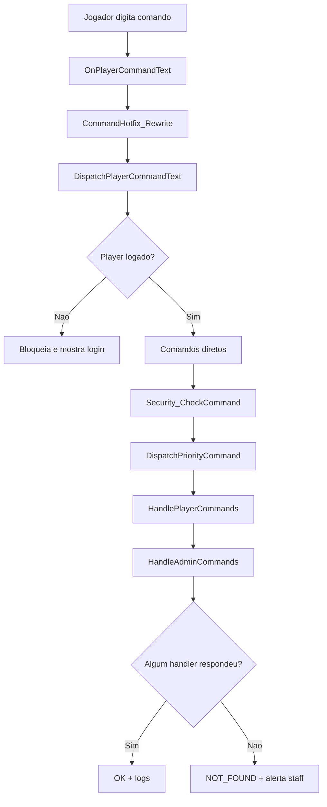
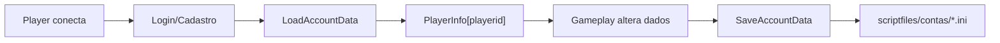
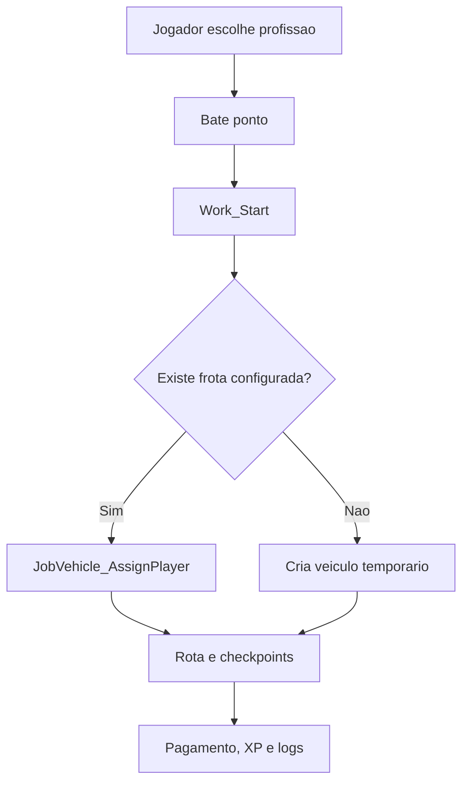
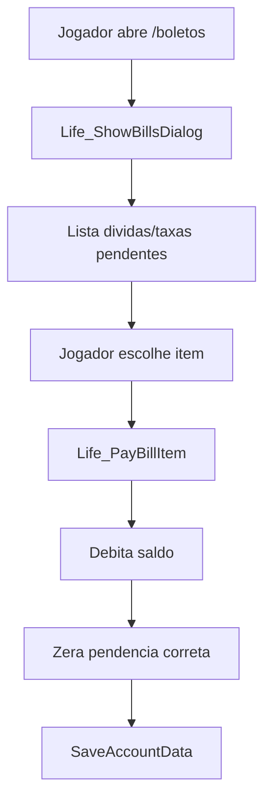
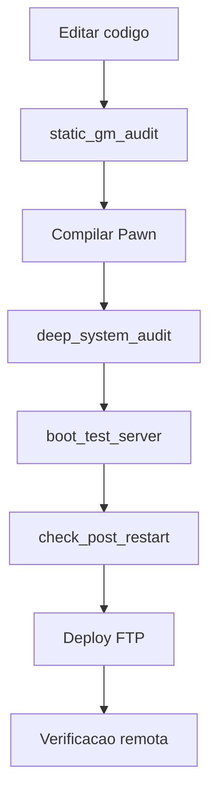

# Mapa do Sistema

Este documento explica a arquitetura da GM **Life Simulator BR** para facilitar manutencao, revisao de codigo e evolucao do servidor.

O projeto e uma gamemode SA-MP em Pawn. O arquivo principal orquestra os eventos do servidor e os sistemas ficam separados em modulos dentro de `include/core`.

## Visao de Alto Nivel



## Ponto de Entrada

O ponto de entrada e `gamemodes/nova_gm.pwn`.

### `OnGameModeInit`

Responsavel por carregar configuracoes, inicializar modulos e criar timers.

Fluxo principal:

1. Carrega `server_info` e `game_config`.
2. Configura clima, animacoes, interiores nativos e motor manual.
3. Cria classes, veiculos, labels e objetos de seguranca do mapa.
4. Inicializa modulos: combustivel, objetos, empregos, policia, crime, propriedades, radar, seguranca, VIP, vida/economia, pedagios, bot e self-heal.
5. Cria timers de HUD, hostname, autosave, necessidades, combustivel, policia e radar.
6. Gera relatorio de integridade.

Arquivo:

```text
gamemodes/nova_gm.pwn
```

## Configuracoes e IDs

As constantes centrais ficam em:

```text
include/core/utils.inc
```

Ali ficam:

| Grupo | Exemplos |
| --- | --- |
| Versao | `GM_VERSION`, `GM_TEXT` |
| Arquivos | `JOB_VEHICLES_FILE`, `MAP_OBJECTS_FILE` |
| Limites | `MAX_JOB_CONFIG_VEHICLES`, `MAX_MAP_OBJECTS` |
| Admin | `ADMIN_LEVEL_HELPER` ate `ADMIN_LEVEL_OWNER` |
| Profissoes | `JOB_POLICIA_FEDERAL`, `JOB_POLICIA_CIVIL`, `JOB_MAX_ID` |
| Dialogs | IDs usados por menus e paineis |

## Roteamento de Comandos

Todo comando entra em:

```text
gamemodes/nova_gm.pwn -> OnPlayerCommandText
```

Depois segue para:

```text
include/core/admin.inc -> DispatchPlayerCommandText
```

Fluxo:



Pontos importantes:

| Funcao | Responsabilidade |
| --- | --- |
| `OnPlayerCommandText` | Recebe tudo que o jogador digita. |
| `CommandHotfix_Rewrite` | Corrige aliases/hotfixes antes do roteamento. |
| `DispatchPlayerCommandText` | Decide qual modulo deve tentar responder. |
| `HandleAdminCommands` | Central dos comandos administrativos. |
| `Dispatch_ShowCommandTest` | Testa comandos protegidos contra `unknown command`. |

## Administracao

Modulo principal:

```text
include/core/admin.inc
```

Niveis:

| Nivel | Constante | Uso comum |
| --- | --- | --- |
| 1 | `ADMIN_LEVEL_HELPER` | Atendimento basico e staff chat. |
| 2 | `ADMIN_LEVEL_GAME` | Teleportes e suporte de gameplay. |
| 3 | `ADMIN_LEVEL_MANAGER` | Operacao intermediaria. |
| 4 | `ADMIN_LEVEL_ADMIN` | Administracao ampla. |
| 5 | `ADMIN_LEVEL_OWNER` | Dono, deploy operacional, editor e comandos criticos. |

Exemplos recentes:

| Comando | Funcao |
| --- | --- |
| `/setlevel`, `/darlevel`, `/tirarlevel` | Controla nivel geral do jogador. |
| `/setadmin`, `/daradmin`, `/tiraradmin` | Controla nivel admin. |
| `/gmxserver` | Reinicia a GM com confirmacao por dialog. |
| `/editarmapa` | Abre editor de mapa, portoes, objetos e frota. |
| `/resgatar`, `/corrigirpos` | Puxa jogador preso para perto do admin nivel 5. |

## Contas e Salvamento

Modulo principal:

```text
include/core/accounts.inc
```

Dados persistentes ficam no padrao SA-MP em:

```text
scriptfiles/contas/*.ini
```

Fluxo:



`PlayerInfo[playerid]` e a estrutura central de estado do jogador durante a sessao.

## Mundo, Locais e Interiores

Modulo principal:

```text
include/core/world.inc
```

Responsabilidades:

- locais do mapa;
- interiores automaticos;
- labels 3D;
- entrada e saida de predios;
- segurancas de posicao;
- celas policiais;
- lojas, restaurantes, bancos e pontos publicos.

Funcoes importantes:

| Funcao | Uso |
| --- | --- |
| `SetPlayerToLocation` | Teleporta para local externo cadastrado. |
| `SetPlayerToAutoInterior` | Coloca o jogador em interior automatico. |
| `World_ExitAutoInterior` | Sai de interior para o local externo. |
| `World_UpdatePlayerInteriors` | Detecta entrada/saida de interiores periodicamente. |
| `World_InitSafetyObjects` | Cria objetos fixos de seguranca do mapa. |

## Profissoes e Rotas

Modulo principal:

```text
include/core/jobs.inc
```

Cada profissao possui:

- ID;
- nome;
- descricao;
- local base;
- modelo de veiculo padrao;
- requisito;
- skin;
- pagamento;
- rota.

Exemplo conceitual:

```text
{ JOB_POLICIA_CIVIL, "Policia Civil", "...", LOCATION_JOB_POLICIA_CIVIL, 596, JOB_REQ_POLICE, ... }
```

Fluxo de trabalho:



## Frota de Profissao

Arquivo de dados:

```text
scriptfiles/job_vehicles.txt
```

Formato:

```text
job|model|x|y|z|angle|color1|color2|fuel|interior|virtualworld
```

Modulo:

```text
include/core/jobs.inc
```

Funcoes importantes:

| Funcao | Uso |
| --- | --- |
| `JobVehicle_LoadAll` | Carrega frota persistente no boot. |
| `JobVehicle_SaveLine` | Salva novo veiculo no TXT. |
| `JobVehicle_OnPlayerStateChange` | Bloqueia ou libera uso ao entrar como motorista. |
| `JobVehicle_AddCommand` | Cria veiculo de profissao por comando/editor. |

Regra atual:

- jogador comum so usa frota da propria profissao e com expediente ativo;
- admin nivel 5 pode dirigir qualquer veiculo de profissao.

## Objetos e Portoes

Arquivo de dados:

```text
scriptfiles/map_objects.txt
```

Modulo:

```text
include/core/mapobjects.inc
```

Formato:

```text
type|model|x|y|z|rx|ry|rz|open_x|open_y|open_z|open_rx|open_ry|open_rz|range|speed|interior|virtualworld|name|job
```

Tipos:

| Tipo | Significado |
| --- | --- |
| `0` | objeto fixo |
| `1` | portao movel |

Regras:

- `job=0` significa publico;
- `job=<ID>` restringe o portao para uma profissao;
- portoes funcionam pela buzina/tecla `H` quando o jogador esta dirigindo.

## Vida Civil, Governo e Economia

Modulo principal:

```text
include/core/life_services.inc
```

Responsabilidades:

- boletos;
- taxas;
- GovBR/celular;
- empresas;
- contratos;
- politica;
- obras;
- chamados;
- missoes publicas;
- leiloes;
- reputacao urbana.

Fluxo de boletos:



## Policia e Crime

Modulos:

```text
include/core/police.inc
include/core/crime.inc
```

Responsabilidades:

- abordagem;
- revista;
- ficha;
- procurados;
- prisao;
- blitz;
- barreiras;
- crimes e faccoes;
- mandados e operacoes.

O roteador trata comandos policiais de forma especial para evitar queda em `unknown command`.

## Segurança e Auditoria

Modulos:

```text
include/core/security.inc
include/core/self_heal.inc
include/core/ops.inc
include/core/command_hotfix.inc
```

Responsabilidades:

- cooldown de comandos;
- deteccao de teleport suspeito;
- dinheiro esperado;
- armas invalidas;
- logs;
- comandos desconhecidos;
- hotfixes de aliases;
- relatorios de integridade;
- self-heal operacional.

Comandos uteis:

| Comando | Uso |
| --- | --- |
| `/saudegm` | Saude geral da GM. |
| `/integridade` | Relatorio de integridade. |
| `/selftestgm` | Testes internos. |
| `/releasecheck` | Checklist de release. |
| `/testarcomandos` | Testa comandos protegidos. |
| `/notfounds` | Mostra comandos que cairam em not found. |

## Deploy e Publicacao

Scripts de operacao ficam em:

```text
tools/
```

Scripts privados de FTP/deploy podem existir no ambiente local, mas devem ficar fora do Git publico quando carregam credenciais, estado do host ou dados sensiveis.

Fluxo operacional:



Regra importante:

- `server.cfg` remoto deve ser preservado;
- porta hospedada atual: `7784`;
- dados vivos do editor remoto, como `job_vehicles.txt`, `map_objects.txt` e `editor_locations.txt`, devem ser preservados em deploy normal.

## Como Localizar Onde Mexer

| O que voce quer alterar | Comece por |
| --- | --- |
| Comando admin | `include/core/admin.inc` |
| Comando de jogador | `HandlePlayerCommands` e roteador em `admin.inc` |
| Profissao/rota/pagamento | `include/core/jobs.inc` |
| Veiculo de profissao | `jobs.inc` + `scriptfiles/job_vehicles.txt` |
| Objeto/portao | `include/core/mapobjects.inc` + `scriptfiles/map_objects.txt` |
| Local/interior | `include/core/world.inc` |
| Conta/salvamento | `include/core/accounts.inc` |
| Boletos/economia/cidade | `include/core/life_services.inc` |
| Policia | `include/core/police.inc` |
| Crime | `include/core/crime.inc` |
| Radar | `include/core/radar.inc` |
| Combustivel | `include/core/fuel.inc` |
| Segurança | `include/core/security.inc` |
| Painel web | `vip_panel/` |

## Checklist Mental Para Novas Mudancas

Antes de alterar:

1. Identifique o dominio: admin, mundo, jobs, contas, economia, policia ou mapa.
2. Ache o handler principal do modulo.
3. Veja se existe arquivo em `scriptfiles` que precisa persistir.
4. Confira se o comando precisa entrar no roteador e nos testes de comandos.
5. Rode auditoria/compile antes de publicar.
6. Se for deploy, preserve `server.cfg` remoto e dados vivos do editor.

## Arquivos Mais Importantes

| Arquivo | Por que importa |
| --- | --- |
| `gamemodes/nova_gm.pwn` | Callback principal da GM. |
| `include/core/utils.inc` | Constantes globais, IDs e limites. |
| `include/core/admin.inc` | Roteador, comandos admin e paineis. |
| `include/core/world.inc` | Mapa, locais, interiores e seguranca de posicao. |
| `include/core/jobs.inc` | Profissoes, rotas, frota e XP. |
| `include/core/mapobjects.inc` | Objetos e portoes persistentes. |
| `include/core/accounts.inc` | Conta, login e salvamento. |
| `include/core/life_services.inc` | Economia civil, boletos, governo e servicos. |
| `include/core/police.inc` | Sistema policial. |
| `include/core/security.inc` | Anticheat operacional e auditoria. |
| `README.md` | Visao de portfolio do projeto. |

